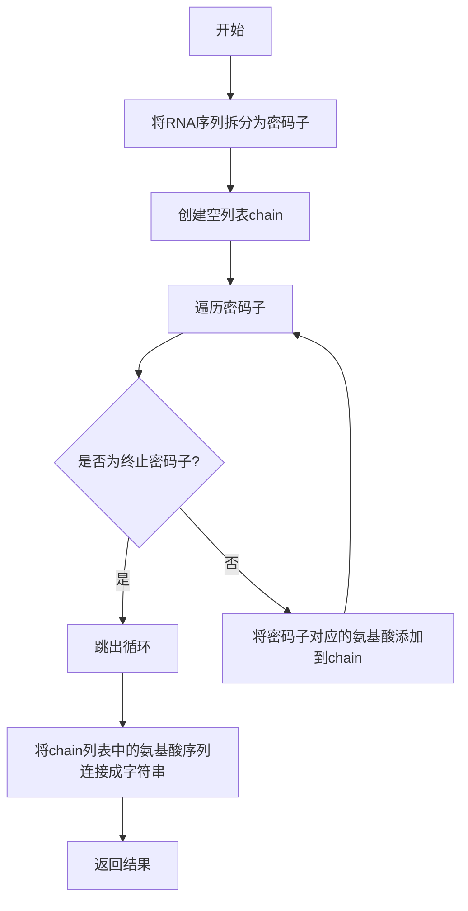

# 实验四 Python字典和while循环

班级： 21计科1

学号： B20210302104

姓名： 金皓翔

Github地址：<https://github.com/jhx666oo/python>

CodeWars地址：<https://www.codewars.com/users/jhx666oo>

---
## 实验过程与结果
### 第一部分

Python列表操作

完成教材《Python编程从入门到实践》下列章节的练习：

- 第6章 字典
  
6.4:
```python
diction = {
    'print': 'ShuChu DaYin',
    'del': 'ShanChu',
    'range': 'HuoDeShuZi',
    'list': 'PaiLie',
    'append': 'TianJia'
}
for key, value in diction.items():
    print(f"{key}\n{value}\n")
```
6.5:
```python
rivers = {
    'nile': 'egypt',
    'changjiang': 'china',
    'misisipi': 'america'
}
for k, v in rivers.items():
    print(f"The {k.title()} runs through {v.title()}")
```
6.6
```python
favorite_languages = {
    'jen': 'python',
    'sarah': 'c',
    'edward': 'ruby',
    'phil': 'python',
    }
friends = ['jen', 'sarah', 'edward', 'phil', 'alex', 'dave', 'chris']
for name in favorite_languages.keys():
    if name in friends:
        print(f"Thank you,{name.title()}")
        friends.remove(name)
for friend in friends:
    print(f"Dear {friend.title()},please join in")
```
6.7
```python
people_1 = {
    'first_name': 'liu',
    'last_name': 'shu',
    'age': '19',
    'city': 'Harbin'
}
people_2 = {
    'first_name': 'cai',
    'last_name': 'xukun',
    'age': '28',
    'city': 'shanghai'
}
people_3 = {
    'first_name': 'li',
    'last_name': 'hao',
    'age': '19',
    'city': 'suzhou'
}
peoples = [people_1, people_2, people_3]
for people in peoples:
    print(people)
```
6.8
```python
pets = {
    'tom' : {
        'first_name':'aa',
        'last_name':'bb',
        'age':18,
        'city':'beijing'
        },
    'jerry' : {
        'first_name': 'cc',
        'last_name': 'dd',
        'age': 78,
        'city': 'shanghai'
        },
}
for username,user_infos in pets.items():
    print("name " + username)
    for user_info in user_infos.values():
        print(user_info)
```
6.9
```python
favorite_places = {
    'alex': 'beijing',
    'bob': 'nanjing',
    'chris': 'shijiazhuang'
}
for k, v in favorite_places.items():
    print(f"I'm {k.title()},I like {v.title()}")
```
6.10
```python
favorite_numbers = {
    'alex': ['1', '3'],
    'bob': ['12', '6'],
    'chris': ['32', '23'],
    'dave': ['52', '43'],
    'eva': ['99']
}
for user, user_info in favorite_numbers.items():
    if len(user_info) > 1:
        print(f"{user.title()}'s numbers are")
        for element in user_info:
            print(element)
    else:
        print(f"{user.title()} have only one number:{user_info}")
```
- 第7章 用户输入和while循环

---

### 第二部分

在[Codewars网站](https://www.codewars.com)注册账号，完成下列Kata挑战：

---

#### 第一题：淘气还是乖孩子（Naughty or Nice）

难度： 7kyu

圣诞老人要来镇上了，他需要你帮助找出谁是淘气的或善良的。你将会得到一整年的JSON数据，按照这个格式：

```python
{
    January: {
        '1': 'Naughty','2': 'Naughty', ..., '31': 'Nice'
    },
    February: {
        '1': 'Nice','2': 'Naughty', ..., '28': 'Nice'
    },
    ...
    December: {
        '1': 'Nice','2': 'Nice', ..., '31': 'Naughty'
    }
}
```

你的函数应该返回 "Naughty!"或 "Nice!"，这取决于在某一年发生的总次数（以较大者为准）。如果两者相等，则返回 "Nice！"。
代码提交地址：
<https://www.codewars.com/kata/5662b14e0a1fb8320a00005c>

代码：
```python
def naughty_or_nice(data):
    days_of_nice=0
    days_of_naughty=0
    for month in data:
        for day in data[month]:
            if data[month][day]=='Nice':
                days_of_nice+=1
            else:
                days_of_naughty+=1
    if days_of_naughty > days_of_nice:
        return "Naughty!"
    elif days_of_nice > days_of_naughty:
        return "Nice!"
    else:
        return "Nice!"
```
思路：
循环嵌套遍历出字典中出现"Naughty！"和"Nice！"的次数，进行比较然后按要求返回。

---

#### 第二题： 观察到的PIN（The observed PIN）

难度：4kyu

好了，侦探，我们的一个同事成功地观察到了我们的目标人物，抢劫犯罗比。我们跟踪他到了一个秘密仓库，我们认为在那里可以找到所有被盗的东西。这个仓库的门被一个电子密码锁所保护。不幸的是，我们的间谍不确定他看到的密码，当罗比进入它时。

键盘的布局如下：

```python
┌───┬───┬───┐
│ 1 │ 2 │ 3 │
├───┼───┼───┤
│ 4 │ 5 │ 6 │
├───┼───┼───┤
│ 7 │ 8 │ 9 │
└───┼───┼───┘
    │ 0 │
    └───┘
```

他注意到密码1357，但他也说，他看到的每个数字都有可能是另一个相邻的数字（水平或垂直，但不是对角线）。例如，代替1的也可能是2或4。而不是5，也可能是2、4、6或8。

他还提到，他知道这种锁。你可以无限制地输入错误的密码，但它们最终不会锁定系统或发出警报。这就是为什么我们可以尝试所有可能的（*）变化。

*可能的意义是：观察到的PIN码本身和考虑到相邻数字的所有变化。

你能帮助我们找到所有这些变化吗？如果有一个函数，能够返回一个列表，其中包含一个长度为1到8位的观察到的PIN的所有变化，那就更好了。我们可以把这个函数命名为getPINs（在python中为get_pins，在C#中为GetPINs）。

但请注意，所有的PINs，包括观察到的PINs和结果，都必须是字符串，因为有可能会有领先的 "0"。我们已经为你准备了一些测试案例。
侦探，我们就靠你了!
代码提交地址：
<https://www.codewars.com/kata/5263c6999e0f40dee200059d>

代码：
```python
def get_pins(observed):
    adjacent_digits = {
        '0': ['0', '8'],
        '1': ['1', '2', '4'],
        '2': ['1', '2', '3', '5'],
        '3': ['2', '3', '6'],
        '4': ['1', '4', '5', '7'],
        '5': ['2', '4', '5', '6', '8'],
        '6': ['3', '5', '6', '9'],
        '7': ['4', '7', '8'],
        '8': ['5', '7', '8', '9', '0'],
        '9': ['6', '8', '9']
    }

    variations = ['']
    for digit in observed:
        new_variations = []
        for variation in variations:
            for adjacent_digit in adjacent_digits[digit]:
                new_variations.append(variation + adjacent_digit)
        variations = new_variations

    return variations

    
    pass # TODO: This is your job, detective! 
```
思路：
用一个字典先将1-9相邻的所有情况装入一个字典中，对于所看见的，初始化一个空列表new_variations，用于存储当前数字对应的所有新的PIN码变体。
对于已经生成的每个PIN码变体variation，遍历该变体对应数字的相邻数字adjacent_digit，将当前变体与相邻数字拼接起来
更新variations为new_variations，以便在下一次循环中使用新的PIN码变体列表。循环结束后，返回最终生成的所有PIN码变体。

---

#### 第三题： RNA到蛋白质序列的翻译（RNA to Protein Sequence Translation）

难度：6kyu

蛋白质是由DNA转录成RNA，然后转译成蛋白质的中心法则。RNA和DNA一样，是由糖骨架（在这种情况下是核糖）连接在一起的长链核酸。每个由三个碱基组成的片段被称为密码子。称为核糖体的分子机器将RNA密码子转译成氨基酸链，称为多肽链，然后将其折叠成蛋白质。

蛋白质序列可以像DNA和RNA一样很容易地可视化，作为大字符串。重要的是要注意，“停止”密码子不编码特定的氨基酸。它们的唯一功能是停止蛋白质的转译，因此它们不会被纳入多肽链中。“停止”密码子不应出现在最终的蛋白质序列中。为了节省您许多不必要（和乏味）的键入，已为您的氨基酸字典提供了键和值。

给定一个RNA字符串，创建一个将RNA转译为蛋白质序列的函数。注意：测试用例将始终生成有效的字符串。

```python
protein（'UGCGAUGAAUGGGCUCGCUCC'）
```

将返回`CDEWARS`

作为测试用例的一部分是一个真实世界的例子！最后一个示例测试用例对应着一种叫做绿色荧光蛋白的蛋白质，一旦被剪切到另一个生物体的基因组中，像GFP这样的蛋白质可以让生物学家可视化细胞过程！

Amino Acid Dictionary

```python
   # Your dictionary is provided as PROTEIN_DICT
   PROTEIN_DICT = {
    # Phenylalanine
    'UUC': 'F', 'UUU': 'F',
    # Leucine
    'UUA': 'L', 'UUG': 'L', 'CUU': 'L', 'CUC': 'L', 'CUA': 'L', 'CUG': 'L',
    # Isoleucine
    'AUU': 'I', 'AUC': 'I', 'AUA': 'I',
    # Methionine
    'AUG': 'M',
    # Valine
    'GUU': 'V', 'GUC': 'V', 'GUA': 'V', 'GUG': 'V',
    # Serine
    'UCU': 'S', 'UCC': 'S', 'UCA': 'S', 'UCG': 'S', 'AGU': 'S', 'AGC': 'S',
    # Proline
    'CCU': 'P', 'CCC': 'P', 'CCA': 'P', 'CCG': 'P',
    # Threonine
    'ACU': 'T', 'ACC': 'T', 'ACA': 'T', 'ACG': 'T',
    # Alanine
    'GCU': 'A', 'GCC': 'A', 'GCA': 'A', 'GCG': 'A',
    # Tyrosine
    'UAU': 'Y', 'UAC': 'Y',
    # Histidine
    'CAU': 'H', 'CAC': 'H',
    # Glutamine
    'CAA': 'Q', 'CAG': 'Q',
    # Asparagine
    'AAU': 'N', 'AAC': 'N',
    # Lysine
    'AAA': 'K', 'AAG': 'K',
    # Aspartic Acid
    'GAU': 'D', 'GAC': 'D',
    # Glutamic Acid
    'GAA': 'E', 'GAG': 'E',
    # Cystine
    'UGU': 'C', 'UGC': 'C',
    # Tryptophan
    'UGG': 'W',
    # Arginine
    'CGU': 'R', 'CGC': 'R', 'CGA': 'R', 'CGG': 'R', 'AGA': 'R', 'AGG': 'R',
    # Glycine
    'GGU': 'G', 'GGC': 'G', 'GGA': 'G', 'GGG': 'G',
    # Stop codon
    'UAA': 'Stop', 'UGA': 'Stop', 'UAG': 'Stop'
}
```

代码提交地址：
<https://www.codewars.com/kata/555a03f259e2d1788c000077>
代码：
```python
def protein(rna):
    codons = [rna[i:i+3]for i in range(0,len(rna),3)]
    chain=[]
    for codon in codons:
        if PROTEIN_DICT[codon] !='Stop':
            chain.append(PROTEIN_DICT[codon])
        else:
            break
    return ''.join(chain)
    # your code here
```
思路：
首先，代码将RNA序列分割成长度为3的子序列，存储在codons列表中
初始化一个空列表chain，用于存储生成的蛋白质链。
对于每个密码子codon，代码检查其在PROTEIN_DICT字典中的映射值。如果映射值不是"Stop"，则说明该密码子对应的是一个氨基酸，将其添加到chain列表中。
如果映射值是"Stop"，则说明已经到达了终止密码子，即蛋白质链的结束位置。在这种情况下，代码终止循环。
最后，将chain列表中的所有氨基酸连接成一个字符串，并将其作为结果返回。

---

#### 第四题： 填写订单（Thinkful - Dictionary drills: Order filler）

难度：8kyu

您正在经营一家在线业务，您的一天中很大一部分时间都在处理订单。随着您的销量增加，这项工作占用了更多的时间，不幸的是最近您遇到了一个情况，您接受了一个订单，但无法履行。

您决定写一个名为`fillable()`的函数，它接受三个参数：一个表示您库存的字典`stock`，一个表示客户想要购买的商品的字符串`merch`，以及一个表示他们想购买的商品数量的整数n。如果您有足够的商品库存来完成销售，则函数应返回`True`，否则应返回`False`。

有效的数据将始终被传入，并且n将始终大于等于1。

代码提交地址：
<https://www.codewars.com/kata/586ee462d0982081bf001f07/python>

代码：
```python
def fillable(stock, merch, n):
    if merch in stock and stock[merch] >= n:
        return True
    else:
        return False
```
思路：
遍历字典求客户想买商品的库存数，并判断是否大于客户购买商品数量n，返回合适的值。

---

#### 第五题： 莫尔斯码解码器（Decode the Morse code, advanced）

难度： 4kyu

在这个作业中，你需要为有线电报编写一个莫尔斯码解码器。
有线电报通过一个有按键的双线路运行，当按下按键时，会连接线路，可以在远程站点上检测到。莫尔斯码将每个字符的传输编码为"点"（按下按键的短按）和"划"（按下按键的长按）的序列。

在传输莫尔斯码时，国际标准规定：

- "点" - 1个时间单位长。
- "划" - 3个时间单位长。
- 字符内点和划之间的暂停 - 1个时间单位长。
- 单词内字符之间的暂停 - 3个时间单位长。
- 单词间的暂停 - 7个时间单位长。

但是，该标准没有规定"时间单位"有多长。实际上，不同的操作员会以不同的速度进行传输。一个业余人士可能需要几秒钟才能传输一个字符，一位熟练的专业人士可以每分钟传输60个单词，而机器人发射器可能会快得多。

在这个作业中，我们假设消息的接收是由硬件自动执行的，硬件会定期检查线路，如果线路连接（远程站点的按键按下），则记录为1，如果线路未连接（远程按键弹起），则记录为0。消息完全接收后，它会以一个只包含0和1的字符串的形式传递给你进行解码。

例如，消息`HEYJUDE`，即`·····−·−−··−−−··−−··`可以如下接收：

```python
1100110011001100000011000000111111001100111111001111110000000000000011001111110011111100111111000000110011001111110000001111110011001100000011
```

如您所见，根据标准，这个传输完全准确，硬件每个"点"采样了两次。

因此，你的任务是实现两个函数：

函数decodeBits(bits)，应该找出消息的传输速率，正确解码消息为点（.）、划（-）和空格（字符之间有一个空格，单词之间有三个空格），并将它们作为一个字符串返回。请注意，在消息的开头和结尾可能会出现一些额外的0，确保忽略它们。另外，如果你无法分辨特定的1序列是点还是划，请假设它是一个点。

函数decodeMorse(morseCode)，它将接收上一个函数的输出，并返回一个可读的字符串。

注意：出于编码目的，你必须使用ASCII字符.和-，而不是Unicode字符。

莫尔斯码表已经预加载给你了（请查看解决方案设置，以获取在你的语言中使用它的标识符）。

```python
morseCodes(".--")  #to access the morse translation of ".--"
```

下面是Morse码支持的完整字符列表：

```javascript
A    ·–
B    –···
C    –·–·
D    –··
E    ·
F    ··–·
G    ––·
H    ····
I    ··
J    ·–––
K    –·–
L    ·–··
M    ––
N    –·
O    –––
P    ·––·
Q    ––·–
R    ·–·
S    ···
T    –
U    ··–
V    ···–
W    ·––
X    –··–
Y    –·––
Z    ––··
0    –––––
1    ·––––
2    ··–––
3    ···––
4    ····–
5    ·····
6    –····
7    ––···
8    –––··
9    ––––·
.    ·–·–·–
,    ––··––
?    ··––··
'    ·––––·
!    –·–·––
/    –··–·
(    –·––·
)    –·––·–
&    ·–···
:    –––···
;    –·–·–·
=    –···–
+    ·–·–·
-    –····–
_    ··––·–
"    ·–··–·
$    ···–··–
@    ·––·–·
```

代码提交地址：
<https://www.codewars.com/kata/decode-the-morse-code-advanced>

代码：
```python
def decode_bits(bits):
    bits = bits.strip("0")
    unit = 0
    for bit in bits:
        if bit != "0":
            unit += 1
        else:
            break
    #unit now might be 1 unit or 3 units
    count = 1
    for i in range(1,len(bits)):
        if bits[i] == bits[i-1]:
            count += 1
        else:
            if count < unit:
                unit = count
                count = 1
            else:
                count = 1
    morse_code = ""
    
    words = bits.split("0"*7*unit)
    for word in words:
        characters = word.split("0"*3*unit)
        for character in characters:
            signs = character.split("0"*unit)
            for sign in signs:
                if sign == "1"*3*unit:
                    morse_code += "-"
                else:
                    morse_code += "."
            morse_code += " "
        morse_code += "   "
    return morse_code
            


def decode_morse(morse_code):
    morse_code.strip()
    result = ""
    characters = morse_code.split(" ")
    for character in characters:
        if character != "":
            result += MORSE_CODE[character]
        else:
            result += " "
    return ' '.join(result.split())

```
---

### 第三部分

使用Mermaid绘制程序流程图



## 实验考查
1. 字典的键和值有什么区别？

字典是Python中的一种数据结构，用于存储键值对。字典的键是唯一的且不可变的，通常用字符串或数字表示。值可以是任意类型的对象，包括字符串、数字、列表、字典等。键用于唯一标识字典中的每个值，而值则是与键相关联的数据。

2. 在读取和写入字典时，需要使用默认值可以使用什么方法？

在读取和写入字典时，可以使用`get()`方法来设置默认值。`get()`方法接受一个键作为参数，并返回与该键相关联的值。如果键不存在于字典中，则返回指定的默认值。例如：

```python
my_dict = {"apple": 1, "banana": 2}

# 读取字典中存在的键
value1 = my_dict.get("apple", 0)  # 返回1

# 读取字典中不存在的键
value2 = my_dict.get("orange", 0)  # 返回0

# 写入字典
my_dict["orange"] = my_dict.get("orange", 0) + 1
```

3. Python中的while循环和for循环有什么区别？

Python中的`while`循环和`for`循环是两种不同的迭代结构。

`while`循环是一个条件控制循环，它会在满足指定条件的情况下重复执行一段代码块。循环会在每次迭代之前检查条件，只要条件为真，就会继续执行循环。例如：

```python
count = 0
while count < 5:
    print(count)
    count += 1
```

`for`循环是一个迭代控制循环，用于遍历可迭代对象（如列表、字符串、字典等）中的元素。循环会按顺序遍历可迭代对象的每个元素，并执行相应的代码块。例如：

```python
fruits = ["apple", "banana", "orange"]
for fruit in fruits:
    print(fruit)
```

4. 阅读PEP 636 – Structural Pattern Matching: Tutorial, 总结Python 3.10中新出现的match语句的使用方法。

在Python 3.10中，引入了新的`match`语句，用于结构化模式匹配。`match`语句可以根据模式对值进行匹配，并根据匹配结果执行相应的代码块。

`match`语句由`match`关键字开始，后面跟着要匹配的值。然后，使用`case`关键字定义不同的模式和相应的代码块。每个`case`子句都包含一个模式和一个代码块，用于匹配特定的值。`case`子句中的模式可以使用变量、常量、通配符和其他模式构造。

以下是一个简单的示例，演示了`match`语句的使用方法：

```python
def process_value(value):
    match value:
        case 0:
            print("Value is zero")
        case 1:
            print("Value is one")
        case x if x > 1:
            print("Value is greater than one")
        case _:
            print("Value is something else")
```

在上面的示例中，根据`value`的不同值，`match`语句将执行相应的代码块。如果`value`为0，则打印"Value is zero"；如果`value`为1，则打印"Value is one"；如果`value`大于1，则打印"Value is greater than one"；如果`value`不匹配任何模式，则打印"Value is something else"。


## 实验总结

总结一下这次实验你学习和使用到的知识，例如：编程工具的使用、数据结构、程序语言的语法、算法、编程技巧、编程思想。

* 在这次实验中，我了解了python字典和循环的使用，辨明了字典键和值、for循环和while循环的区别，并能使用它去解决相关代码问题。