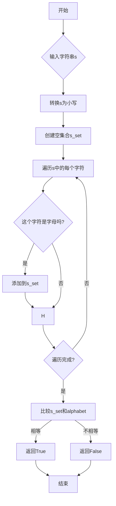

# 实验五 Python数据结构与数据模型

班级： 21计科1

学号： B20210302104

姓名： 金皓翔

Github地址：<https://github.com/jhx666oo/python>

CodeWars地址：<https://www.codewars.com/users/jhx666oo>

---

## 实验目的

1. 学习Python数据结构的高级用法
2. 学习Python的数据模型

## 实验环境

1. Git
2. Python 3.10
3. VSCode
4. VSCode插件

## 实验内容和步骤

### 第一部分

在[Codewars网站](https://www.codewars.com)注册账号，完成下列Kata挑战：

---

#### 第一题：停止逆转我的单词

难度： 6kyu

编写一个函数，接收一个或多个单词的字符串，并返回相同的字符串，但所有5个或更多的字母单词都是相反的（就像这个Kata的名字一样）。传入的字符串将只由字母和空格组成。只有当出现一个以上的单词时，才会包括空格。
例如：

```python
spinWords( "Hey fellow warriors" ) => returns "Hey wollef sroirraw" 
spinWords( "This is a test") => returns "This is a test" 
spinWords( "This is another test" )=> returns "This is rehtona test"
```

代码提交地址：
<https://www.codewars.com/kata/5264d2b162488dc400000001>

提示：

- 利用str的split方法可以将字符串分为单词列表
例如：

```python
words = "hey fellow warrior".split()
# words should be ['hey', 'fellow', 'warrior']
```

- 利用列表推导将长度大于等于5的单词反转(利用切片word[::-1])
- 最后使用str的join方法连结列表中的单词。

代码：
```python
def spin_words(sentence):
    words = sentence.split()
    for i in range(len(words)):
        if len(words[i]) >= 5:
            words[i] = words[i][::-1]
    return " ".join(words)

```
思路：将句子拆分成单个的字符串，遍历字符串的长度，如果大于5，用切片操作，words[i][::-1]将每个字母倒叙输出，最后输出处理之后的字符串。

---

#### 第二题： 发现离群的数(Find The Parity Outlier)

难度：6kyu

给你一个包含整数的数组（其长度至少为3，但可能非常大）。该数组要么完全由奇数组成，要么完全由偶数组成，除了一个整数N。请写一个方法，以该数组为参数，返回这个 "离群 "的N。

例如：

```python
[2, 4, 0, 100, 4, 11, 2602, 36]
# Should return: 11 (the only odd number)

[160, 3, 1719, 19, 11, 13, -21]
# Should return: 160 (the only even number)
```

代码提交地址：
<https://www.codewars.com/kata/5526fc09a1bbd946250002dc>

代码：

```python
def find_outlier(integers):
    # Count the number of even and odd integers
    even_count = 0
    odd_count = 0
    last_even = None
    last_odd = None

    for num in integers:
        if num % 2 == 0:
            even_count += 1
            last_even = num
        else:
            odd_count += 1
            last_odd = num

        # Check if we've identified the majority
        if even_count > 1 and odd_count == 1:
            return last_odd
        if odd_count > 1 and even_count == 1:
            return last_even

    # If no majority is found, return the last identified integer
    return last_even if even_count > 0 else last_odd
```

思路：这个代码的核心思想是通过统计整数类型的个数，然后在找到大多数类型时返回另一类型的最后一个整数，来判断离群值。

---

#### 第三题： 检测Pangram

难度：6kyu

pangram是一个至少包含每个字母一次的句子。例如，"The quick brown fox jumps over the lazy dog "这个句子就是一个pangram，因为它至少使用了一次字母A-Z（大小写不相关）。

给定一个字符串，检测它是否是一个pangram。如果是则返回`True`，如果不是则返回`False`。忽略数字和标点符号。
代码提交地址：
<https://www.codewars.com/kata/545cedaa9943f7fe7b000048>

代码：
```python
def is_pangram(s):
    alphabet = set('abcdefghijklmnopqrstuvwxyz')
    s = s.lower()
    s_set = set([char for char in s if char.isalpha()])
    return s_set == alphabet

```
思路：因为不区分大小写，所以先将所有字母转换为小写，之后建立一个包含所有英文字母的字符串，遍历判断是不是有所有字母。

---

#### 第四题： 数独解决方案验证

难度：6kyu

数独背景

数独是一种在 9x9 网格上进行的游戏。游戏的目标是用 1 到 9 的数字填充网格的所有单元格，以便每一列、每一行和九个 3x3 子网格（也称为块）中的都包含数字 1 到 9。更多信息请访问：<http://en.wikipedia.org/wiki/Sudoku>

编写一个函数接受一个代表数独板的二维数组，如果它是一个有效的解决方案则返回 true，否则返回 false。数独板的单元格也可能包含 0，这将代表空单元格。包含一个或多个零的棋盘被认为是无效的解决方案。棋盘总是 9 x 9 格，每个格只包含 0 到 9 之间的整数。

代码提交地址：
<https://www.codewars.com/kata/63d1bac72de941033dbf87ae>

---
代码：
```python
def isValidSudoku(board):
    rows = [set() for _ in range(9)]
    cols = [set() for _ in range(9)]
    boxes = [set() for _ in range(9)]
    
    for i in range(9):
        for j in range(9):
            num = board[i][j]
            if num == 0:
                return False  # 无效，因为它包含空格
            
            if num in rows[i] or num in cols[j] or num in boxes[(i//3)*3 + j//3]:
                return False  # 无效，因为行、列或框中有重复
            
            rows[i].add(num)
            cols[j].add(num)
            boxes[(i//3)*3 + j//3].add(num)
            
    return True

```
思路：创建三种数据结构来存储每行、每列以及每个3x3子网格中已经出现的数字。
遍历数独板上的每个数字：
检查是否有空单元格（数字0），有则返回False。
检查该数字在其所在行、列和3x3子网格中是否唯一。不唯一则返回False。
将数字添加到其所在行、列和3x3子网格的集合中。
返回结果
如果遍历过程中没有发现问题，返回True，表示这是一个有效的数独解决方案。
#### 第五题： 疯狂的彩色三角形

难度： 2kyu

一个彩色的三角形是由一排颜色组成的，每一排都是红色、绿色或蓝色。连续的几行，每一行都比上一行少一种颜色，是通过考虑前一行中的两个相接触的颜色而产生的。如果这些颜色是相同的，那么新的一行就使用相同的颜色。如果它们不同，则在新的一行中使用缺失的颜色。这个过程一直持续到最后一行，只有一种颜色被生成。

例如：
```python
Colour here:            G G        B G        R G        B R
Becomes colour here:     G          R          B          G
```


一个更大的三角形例子：

```python
R R G B R G B B
 R B R G B R B
  G G B R G G
   G R G B G
    B B R R
     B G R
      R B
       G
```

你将得到三角形的第一行字符串，你的工作是返回最后的颜色，这将出现在最下面一行的字符串。在上面的例子中，你将得到 "RRGBRGBB"，你应该返回 "G"。
限制条件： 1 <= length(row) <= 10 ** 5
输入的字符串将只包含大写字母'B'、'G'或'R'。

例如：

```python
triangle('B') == 'B'
triangle('GB') == 'R'
triangle('RRR') == 'R'
triangle('RGBG') == 'B'
triangle('RBRGBRB') == 'G'
triangle('RBRGBRBGGRRRBGBBBGG') == 'G'
```

代码提交地址：
<https://www.codewars.com/kata/5a331ea7ee1aae8f24000175>

提示：请参考下面的链接，利用三进制的特点来进行计算。
<https://stackoverflow.com/questions/53585022/three-colors-triangles>

---

### 第二部分
第三题： 检测Pangram
使用Mermaid绘制程序流程图




## 实验过程与结果

请将实验过程与结果放在这里，包括：

- [第一部分 Codewars Kata挑战](#第一部分)
- [第二部分 使用Mermaid绘制程序流程图](#第二部分)

注意代码需要使用markdown的代码块格式化，例如Git命令行语句应该使用下面的格式：


显示效果如下：

```bash
git init
git add .
git status
git commit -m "first commit"
```

如果是Python代码，应该使用下面代码块格式，例如：


显示效果如下：

```python
def add_binary(a,b):
    return bin(a+b)[2:]
```

代码运行结果的文本可以直接粘贴在这里。

**注意：不要使用截图，因为Markdown文档转换为Pdf格式后，截图会无法显示。**

## 实验考查

请使用自己的语言并使用尽量简短代码示例回答下面的问题，这些问题将在实验检查时用于提问和答辩以及实际的操作。

1. 集合（set）类型有什么特点？它和列表（list）类型有什么区别？
2. 集合（set）类型主要有那些操作？
3. 使用`*`操作符作用到列表上会产生什么效果？为什么不能使用`*`操作符作用到嵌套的列表上？使用简单的代码示例说明。
4. 总结列表,集合，字典的解析（comprehension）的使用方法。使用简单的代码示例说明。
---

1. **集合 vs 列表**:
   - 集合无序唯一，列表有序可重复。
   ```python
   my_list = [1, 2, 2, 3]
   my_set = set(my_list)  # {1, 2, 3}
   ```

2. **集合操作**:
   - 添加: `add`, 删除: `remove`/`discard`, 集合运算: `&`, `|`, `-`, `^`.
   ```python
   set1 = {1, 2, 3}
   set2 = {3, 4, 5}
   intersection = set1 & set2  # {3}
   ```

3. **列表`*`操作符**:
   - 重复列表元素:
   ```python
   my_list = [1, 2]
   repeated = my_list * 3  # [1, 2, 1, 2, 1, 2]
   ```
   - 嵌套列表共享引用:
   ```python
   nested = [[1]] * 3
   nested[0][0] = 2  # [[2], [2], [2]]
   ```

4. **解析**:
   - 列表解析:
   ```python
   squares = [n**2 for n in [1, 2, 3]]  # [1, 4, 9]
   ```
   - 集合解析:
   ```python
   unique = {n**2 for n in [1, 2, 2, 3]}  # {1, 4, 9}
   ```
   - 字典解析:
   ```python
   lengths = {word: len(word) for word in ["hi", "bye"]}  # {'hi': 2, 'bye': 3}
   ```

## 实验总结

总结一下这次实验你学习和使用到的知识，例如：编程工具的使用、数据结构、程序语言的语法、算法、编程技巧、编程思想。

- 这次实验我了解了字符串中字母提取、倒叙操作，数独问题遍历，集合和列表相关操作等知识，提高了自己的编程思维。