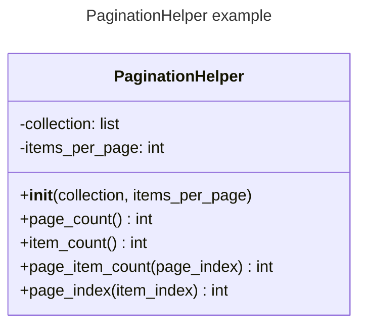

# 实验七 Python面向对象编程

班级： 21计科1

学号： 202302200000

姓名： 张三

Github地址：<https://github.com/jhx666oo/python>

CodeWars地址：<https://www.codewars.com/users/jhx666oo>

---

## 实验目的

1. 学习Python类和继承的基础知识
2. 学习namedtuple和DataClass的使用

## 实验环境

1. Git
2. Python 3.10
3. VSCode
4. VSCode插件

## 实验内容和步骤

### 第一部分

Python面向对象编程

完成教材《Python编程从入门到实践》下列章节的练习：

- 第9章 类

---

### 第二部分

在[Codewars网站](https://www.codewars.com)注册账号，完成下列Kata挑战：

---

#### 第一题：面向对象的海盗

难度： 8kyu

啊哈，伙计!

你是一个小海盗团的首领。而且你有一个计划。在OOP的帮助下，你希望建立一个相当有效的系统来识别船上有大量战利品的船只。
对你来说，不幸的是，现在的人很重，那么你怎么知道一艘船上装的是黄金而不是人呢？

你首先要写一个通用的船舶类。

```python
class Ship:
    def __init__(self, draft, crew):
        self.draft = draft
        self.crew = crew
```

每当你的间谍看到一艘新船进入码头，他们将根据观察结果创建一个新的船舶对象。

- `draft`吃水 - 根据船在水中的高度来估计它的重量
- `crew`船员 - 船上船员的数量

`Titanic = Ship(15, 10)`

任务

你可以访问船舶的 "draft(吃水) "和 "crew(船员)"。"draft(吃水) "是船的总重量，"船员 "是船上的人数。
每个船员都会给船的吃水增加1.5个单位。如果除去船员的重量后，吃水仍然超过20，那么这艘船就值得掠夺。任何有这么重的船一定有很多战利品!
添加方法
`is_worth_it`
来决定这艘船是否值得掠夺。

例如：

```python
Titanic.is_worth_it()
False
```

祝你好运，愿你能找到金子!

代码提交地址：
<https://www.codewars.com/kata/54fe05c4762e2e3047000add>

代码：
```python
class Ship:
    def __init__(self, draft, crew):
        self.draft = draft  # Total weight of the ship
        self.crew = crew    # Number of crew members

    def is_worth_it(self):
        # Subtract the weight contributed by the crew
        net_draft = self.draft - (self.crew * 1.5)
        # Check if the net draft is more than 20
        return net_draft > 20

```
思路：判断吃水的深度减去船员总重量所占的深度，剩余的吃水深度是否大于20，若是则表示可以掠夺。

---

#### 第二题： 搭建积木

难度：7kyu

写一个创建Block的类（Duh.）
构造函数应该接受一个数组作为参数，这个数组将包含3个整数，其形式为`[width, length, height]`，Block应该由这些整数创建。

定义这些方法:

- `get_width()` return the width of the `Block`
- `get_length()` return the length of the `Block`
- `get_height()` return the height of the `Block`
- `get_volume()` return the volume of the `Block`
- `get_surface_area()` return the surface area of the `Block`

例子：

```python
b = Block([2,4,6]) # create a `Block` object with a width of `2` a length of `4` and a height of `6`
b.get_width() # return 2    
b.get_length() # return 4
b.get_height() # return 6
b.get_volume() # return 48
b.get_surface_area() # return 88
```

注意： 不需要检查错误的参数。

代码提交地址：
<https://www.codewars.com/kata/55b75fcf67e558d3750000a3>

代码:
```python
class Block:
    # Good Luck!class Block:
    def __init__(self, dimensions):
        self.width = dimensions[0]
        self.length = dimensions[1]
        self.height = dimensions[2]

    def get_width(self):
        return self.width

    def get_length(self):
        return self.length

    def get_height(self):
        return self.height

    def get_volume(self):
        return self.width * self.length * self.height

    def get_surface_area(self):
        # 表面积 = 2*(长*宽 + 长*高 + 宽*高)
        return 2 * (self.width * self.length + self.length * self.height + self.width * self.height)

```
思路：六个方法分别是代表初始化、长、宽、高、体积、表面积，简单的四则运算表示。

---

#### 第三题： 分页助手

难度：5kyu

在这个练习中，你将加强对分页的掌握。你将完成PaginationHelper类，这是一个实用类，有助于查询与数组有关的分页信息。
该类被设计成接收一个值的数组和一个整数，表示每页允许多少个项目。集合/数组中包含的值的类型并不相关。

下面是一些关于如何使用这个类的例子：

```python
helper = PaginationHelper(['a','b','c','d','e','f'], 4)
helper.page_count() # should == 2
helper.item_count() # should == 6
helper.page_item_count(0)  # should == 4
helper.page_item_count(1) # last page - should == 2
helper.page_item_count(2) # should == -1 since the page is invalid

# page_index takes an item index and returns the page that it belongs on
helper.page_index(5) # should == 1 (zero based index)
helper.page_index(2) # should == 0
helper.page_index(20) # should == -1
helper.page_index(-10) # should == -1 because negative indexes are invalid
```

代码提交地址：
<https://www.codewars.com/kata/515bb423de843ea99400000a>

```python
class PaginationHelper:
    def __init__(self, collection, items_per_page):
        self.collection = collection
        self.items_per_page = items_per_page

    def page_count(self):
        # 计算总页数
        return (len(self.collection) + self.items_per_page - 1) // self.items_per_page

    def item_count(self):
        # 返回总项目数
        return len(self.collection)

    def page_item_count(self, page_index):
        # 返回指定页的项目数
        if page_index < 0 or page_index >= self.page_count():
            return -1
        if page_index == self.page_count() - 1:
            return len(self.collection) % self.items_per_page or self.items_per_page
        return self.items_per_page

    def page_index(self, item_index):
        # 根据项目索引返回页码
        if item_index < 0 or item_index >= len(self.collection):
            return -1
        return item_index // self.items_per_page
```

思路：
1. **初始化（构造函数）**：
   - 类的构造函数接收两个参数：一个表示项目集合的数组和一个表示每页项目数的整数。
   - 这些参数在类实例中以属性的形式存储。

2. **计算总页数（`page_count` 方法）**：
   - 使用整除运算（`//`）计算总页数。这是通过将总项目数除以每页项目数并向上取整得到的。

3. **计算总项目数（`item_count` 方法）**：
   - 直接返回输入数组的长度。

4. **计算特定页的项目数（`page_item_count` 方法）**：
   - 如果页码无效（例如，超出范围），返回 -1。
   - 对于最后一页，返回剩余的项目数（如果剩余的项目数少于每页的项目数）。
   - 对于其他页，返回每页的项目数。

5. **确定项目所在的页码（`page_index` 方法）**：
   - 如果项目索引无效（负数或超出数组长度），返回 -1。
   - 否则，使用整除运算计算项目索引对应的页码。


---

#### 第四题： 向量（Vector）类

难度： 5kyu

创建一个支持加法、减法、点积和向量长度的向量（Vector）类。

举例来说：

```python
a = Vector([1, 2, 3])
b = Vector([3, 4, 5])
c = Vector([5, 6, 7, 8])

a.add(b)      # should return a new Vector([4, 6, 8])
a.subtract(b) # should return a new Vector([-2, -2, -2])
a.dot(b)      # should return 1*3 + 2*4 + 3*5 = 26
a.norm()      # should return sqrt(1^2 + 2^2 + 3^2) = sqrt(14)
a.add(c)      # raises an exception
```

如果你试图对两个不同长度的向量进行加减或点缀，你必须抛出一个错误。
向量类还应该提供：

- 一个 `__str__` 方法，这样 `str(a) === '(1,2,3)'` 
- 一个equals方法，用来检查两个具有相同成分的向量是否相等。

注意：测试案例将利用用户提供的equals方法。

代码提交地址：
<https://www.codewars.com/kata/526dad7f8c0eb5c4640000a4>

```python
import math

class Vector:
    def __init__(self, components):
        self.components = components

    def check_length(self, other):
        if len(self.components) != len(other.components):
            raise ValueError("Vectors must be of same length")

    def add(self, other):
        self.check_length(other)
        return Vector([x + y for x, y in zip(self.components, other.components)])

    def subtract(self, other):
        self.check_length(other)
        return Vector([x - y for x, y in zip(self.components, other.components)])

    def dot(self, other):
        self.check_length(other)
        return sum(x * y for x, y in zip(self.components, other.components))

    def norm(self):
        return math.sqrt(sum(x**2 for x in self.components))

    def __str__(self):
        return f'({",".join(map(str, self.components))})'

    def equals(self, other):
        return self.components == other.components

```
---

#### 第五题： Codewars风格的等级系统

难度： 4kyu

编写一个名为User的类，用于计算用户在类似于Codewars使用的排名系统中的进步量。

业务规则：

- 一个用户从等级-8开始，可以一直进步到8。
- 没有0（零）等级。在-1之后的下一个等级是1。
- 用户将完成活动。这些活动也有等级。
- 每当用户完成一个有等级的活动，用户的等级进度就会根据活动的等级进行更新。
- 完成活动获得的进度是相对于用户当前的等级与活动的等级而言的。
- 用户的等级进度从零开始，每当进度达到100时，用户的等级就会升级到下一个等级。
- 在上一等级时获得的任何剩余进度都将被应用于下一等级的进度（我们不会丢弃任何进度）。例外的情况是，如果没有其他等级的进展（一旦你达到8级，就没有更多的进展了）。
- 一个用户不能超过8级。
- 唯一可接受的等级值范围是-8,-7,-6,-5,-4,-3,-2,-1,1,2,3,4,5,6,7,8。任何其他的值都应该引起错误。

逻辑案例：

- 如果一个排名为-8的用户完成了一个排名为-7的活动，他们将获得10的进度。
- 如果一个排名为-8的用户完成了排名为-6的活动，他们将获得40的进展。
- 如果一个排名为-8的用户完成了排名为-5的活动，他们将获得90的进展。
- 如果一个排名-8的用户完成了排名-4的活动，他们将获得160个进度，从而使该用户升级到排名-7，并获得60个进度以获得下一个排名。
- 如果一个等级为-1的用户完成了一个等级为1的活动，他们将获得10个进度（记住，零等级会被忽略）。

代码案例：

```python
user = User()
user.rank # => -8
user.progress # => 0
user.inc_progress(-7)
user.progress # => 10
user.inc_progress(-5) # will add 90 progress
user.progress # => 0 # progress is now zero
user.rank # => -7 # rank was upgraded to -7
```

代码提交地址：
<https://www.codewars.com/kata/51fda2d95d6efda45e00004e>

代码：
```python
class User ():    
    def __init__ (self):
        self.RANKS = [-8, -7, -6, -5, -4, -3, -2, -1, 1, 2, 3, 4, 5, 6, 7, 8]
        self.rank = -8
        self.rank_index = 0
        self.progress = 0
        
    def inc_progress (self, rank):
        rank_index = self.RANKS.index(rank)
        
        # 计算rank的差，得出可以获得多少进度
        
        # 完成的是同等级的题目
        if rank_index == self.rank_index:
            self.progress += 3
            
        # 完成的是比当前等级低一级的题目
        elif rank_index == self.rank_index - 1:
            self.progress += 1
            
        # 完成的是比当前等级高的题目
        elif rank_index > self.rank_index:
            difference = rank_index - self.rank_index
            self.progress += 10 * difference * difference
        
        # 如果进度大于100，升级，每减去100进度，升一级    
        while self.progress >= 100:
            self.rank_index += 1
            self.rank = self.RANKS[self.rank_index]
            self.progress -= 100    
        
            # 如果升到8级（最高级），进度被置为0
            if self.rank == 8:
                self.progress = 0
                return
```
---

### 第三部分

使用Mermaid绘制程序的**类图**




## 实验过程与结果

请将实验过程与结果放在这里，包括：

- [第一部分 Python面向对象编程](#第一部分)
- [第二部分 Codewars Kata挑战](#第二部分)
- [第三部分 使用Mermaid绘制程序流程图](#第三部分)

注意代码需要使用markdown的代码块格式化，例如Git命令行语句应该使用下面的格式：


显示效果如下：

```bash
git init
git add .
git status
git commit -m "first commit"
```

如果是Python代码，应该使用下面代码块格式，例如：


显示效果如下：

```python
def add_binary(a,b):
    return bin(a+b)[2:]
```

代码运行结果的文本可以直接粘贴在这里。

**注意：不要使用截图，Markdown文档转换为Pdf格式后，截图可能会无法显示。**

## 实验考查

请使用自己的语言并使用尽量简短代码示例回答下面的问题，这些问题将在实验检查时用于提问和答辩以及实际的操作。

1. Python的类中__init__方法起什么作用？
2. Python语言中如何继承父类和改写（override）父类的方法。
3. Python类有那些特殊的方法？它们的作用是什么？请举三个例子并编写简单的代码说明。


### 1. Python 类中 `__init__` 方法的作用

在 Python 中，`__init__` 方法是一个特殊的方法，通常称为类的构造器。它在创建类的新实例时自动调用，用于初始化该实例的属性或执行任何其他启动时必要的设置。

**示例代码**：

```python
class Person:
    def __init__(self, name, age):
        self.name = name
        self.age = age

# 创建 Person 类的实例
person = Person("Alice", 30)
```

### 2. Python 语言中如何继承父类和改写（override）父类的方法

在 Python 中，可以通过简单地在类定义时在括号中指定父类来实现继承。要改写（override）一个父类方法，只需在子类中定义一个与父类方法同名的方法。

**示例代码**：

```python
class Animal:
    def make_sound(self):
        print("Some generic sound")

class Dog(Animal):
    def make_sound(self):
        print("Bark")

# 使用子类
dog = Dog()
dog.make_sound()  # 输出: Bark
```

### 3. Python 类中的特殊方法及其作用

Python 的特殊方法通常被称为魔术方法，以双下划线开头和结尾。这些方法为类提供了特殊的内部功能。

**三个例子**：

- `__str__`: 当需要将对象转换为其字符串表示形式时调用。
- `__len__`: 用来返回容器类型的长度（如列表、字典等）。
- `__add__`: 定义加法操作的行为。

**示例代码**：

```python
class Book:
    def __init__(self, title):
        self.title = title

    def __str__(self):
        return f"Book: {self.title}"

    def __len__(self):
        return len(self.title)

book = Book("Python 101")
print(str(book))  # 输出: Book: Python 101
print(len(book))  # 输出: 10
```

## 实验总结

-通过这次实验，我了解了学习Python类和继承的基础知识以及namedtuple和DataClass的使用，知道了python面向对象的编程模式，通过这次实验的学习，为之后独立进行项目的学习奠定了基础。