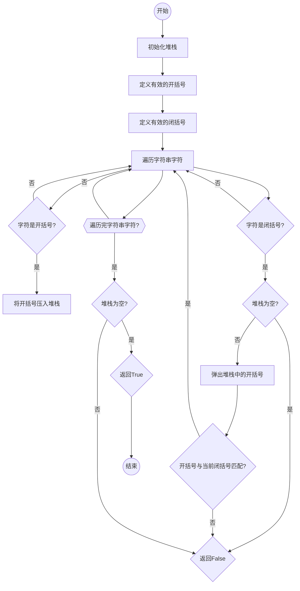

# 实验三 Python列表

班级： 21计科1

学号： B20210302104

姓名： 金皓翔

Github地址：<https://github.com/jhx666oo/python>

CodeWars地址：<https://www.codewars.com/users/jhx666oo>


## 实验过程与结果

### 第一部分

Python列表操作

完成教材《Python编程从入门到实践》下列章节的练习：

- 第3章 列表简介
* 3.1
```python
names = ['lzy','lyy','zk']
print(names[0].title(),names[1].title(),names[2].title())
```
* 3.2
```python
names = ['lzy','lyy','zk']
greeting="have a nice day!"
hi="Hi "
print(hi+names[0].title()+greeting,"\n"+hi+names[1].title()+greeting,"\n"+hi+names[2].title()+greeting)
```  
* 3.3
```python
vehicle = ['by bike','walk','driver a car']
print("I would like to go office "+vehicle[0])
```
* 3.4
```python
#3-4嘉宾名单：如何你可以邀请任何人一起共进晚餐（无论是在世的还是故去的）。你会邀请哪些人？请创建一个列表，其中包含至少3个你想邀请的人；然后，使用这个列表打印消息，邀请这些人来与你共进晚餐。
print("嘉宾名单")
names = ['科比','牢大','黑曼巴']
message =" would you like to have lunch with me?"
print(names[0].title()+message.title(),"\n"+names[1].title()+message.title(),"\n"+names[2].title()+message)
print("\n")

```
* 3.5
```python
print("修改嘉宾名称")
print(names[2].title()+" can not go to lunch with me.")
names[2]='jinhaoxiang'
print(names[0].title()+message.title(),"\n"+names[1].title()+message.title(),"\n"+names[2].title()+message)
print("\n")

```
* 3.6
```python
print("添加嘉宾")
good_news ='I got 100 grades in python class.'
print(good_news)
print("\n")
 
print("添加嘉宾到名单开头")
#使用insert()将一位嘉宾添加到名单开头。
names.insert(0,'lyy')
print(names)
print("\n")
 
print("使用insert()将另一位新嘉宾添加到名单中间。")
lenght=len(names)
print(lenght)
names.insert(lenght//2,'lzy')
print(names)
print(len(names))
print(names[0].title()+message.title(),"\n"+names[1].title()+message.title(),"\n"+names[2].title()+message+"\n"+names[3].title()+message+"\n"+names[4].title()+message)
print("\n")

```
* 3.7
```python
print("缩减名单：只能邀请两位嘉宾，在程序末尾添加一行代码，打印一条你只能邀请两位嘉宾的消息")
bad_message = " so sorry,I just can invate two person to go lunch with me."
print("\n")
 
print("3-7-2使用pop()不断删除名单中的嘉宾，直到有两位嘉宾为止，每次从名单中弹出一位嘉宾时，都打印一条消息，让嘉宾知悉你很抱歉，无法邀请他们来共进晚餐。")
print(bad_message)
popped_names = names.pop()
print(names)
print(popped_names+bad_message)
popped_names = names.pop()
print(names)
print(popped_names+bad_message)
popped_names = names.pop()
print(names)
print(popped_names+bad_message)
print("\n")
 
print("3-9晚餐嘉宾，len()")
print(len(names))
print("\n")
 
 
print("3-7-3对于余下的两位嘉宾中的每一位，都打印一条消息，支出他依然在受邀人之列。")
last_message = " You're still on the list of invitees"
print(names[0]+last_message)
print(names[1]+last_message)
del names[0]
print(names)
del names[0]
print(names)
print("\n")
```
* 3.8
```python
places = ['changsha','America','England','xian','Japan']
print(places)
places.sort()
print(places)
places.sort()
print(places)
places.reverse()
print(places)
places.reverse()
print(places)
places.sort()
print(places)
places.sort()
print(places)
```

- 第4章 操作列表
- 第5章 if语句

---

### 第二部分

在[Codewars网站](https://www.codewars.com)注册账号，完成下列Kata挑战：

---

#### 第一题：3和5的倍数（Multiples of 3 or 5）

难度： 6kyu

如果我们列出所有低于 10 的 3 或 5 倍数的自然数，我们得到 3、5、6 和 9。这些数的总和为 23. 完成一个函数，使其返回小于某个整数的所有是3 或 5 的倍数的数的总和。此外，如果数字为负数，则返回 0。

注意：如果一个数同时是3和5的倍数，应该只被算一次。

**提示：首先使用列表解析得到一个列表，元素全部是3或者5的倍数。
使用sum函数可以获取这个列表所有元素的和.**

代码：
``` python
def solution(n):
    if n < 0:
        return 0

    total = 0
    for i in range(n):
        if i % 3 == 0 or i % 5 == 0:
            total += i

    return total
pass
```
思路：
* 遍历找出所有能被3和5整除的数，这便是同时是3和5倍数的数，把他们相加求和。

---
#### 第二题： 重复字符的编码器（Duplicate Encoder）

难度： 6kyu

本练习的目的是将一个字符串转换为一个新的字符串，如果新字符串中的每个字符在原字符串中只出现一次，则为"("，如果该字符在原字符串中出现多次，则为")"。在判断一个字符是否是重复的时候，请忽略大写字母。

例如:

```python
"din"      =>  "((("
"recede"   =>  "()()()"
"Success"  =>  ")())())"
"(( @"     =>  "))(("
```

代码提交地址:
<https://www.codewars.com/kata/54b42f9314d9229fd6000d9c>
```python
def duplicate_encode(word):
    word = word.lower()  
    result = ""

    for char in word:
        if word.count(char) > 1:
            result += ")"
        else:
            result += "("

    return result
```
思路：
* 因为忽略大写字母，所以先将字符串全变为小写，之后遍历，判断条件为是否重复出现一次以上，若出现则赋值为“)”，反之则赋值为“(”,存到新字符串里输出。
---

#### 第三题：括号匹配（Valid Braces）

难度：6kyu

写一个函数，接收一串括号，并确定括号的顺序是否有效。如果字符串是有效的，它应该返回True，如果是无效的，它应该返回False。
例如：

```python
"(){}[]" => True 
"([{}])" => True
 "(}" => False
 "[(])" => False 
"[({})](]" => False
```

**提示：
python中没有内置堆栈数据结构，可以直接使用`list`来作为堆栈，其中`append`方法用于入栈，`pop`方法可以出栈。**

代码提交地址
<https://www.codewars.com/kata/5277c8a221e209d3f6000b56>

代码：
```python
def valid_braces(string):
    stack = []
    opening_braces = "({["
    closing_braces = ")}]"

    for char in string:
        if char in opening_braces:
            stack.append(char)
        elif char in closing_braces:
            if not stack:
                return False  

            last_opening_brace = stack.pop()
            if opening_braces.index(last_opening_brace) != closing_braces.index(char):
                return False  

    return not stack

```
思路：
* 建立一个栈，是有效顺序的字符则入栈。
---

#### 第四题： 从随机三元组中恢复秘密字符串(Recover a secret string from random triplets)

难度： 4kyu

有一个不为你所知的秘密字符串。给出一个随机三个字母的组合的集合，恢复原来的字符串。

这里的三个字母的组合被定义为三个字母的序列，每个字母在给定的字符串中出现在下一个字母之前。"whi "是字符串 "whatisup "的一个三个字母的组合。

作为一种简化，你可以假设没有一个字母在秘密字符串中出现超过一次。

对于给你的三个字母的组合，除了它们是有效的三个字母的组合以及它们包含足够的信息来推导出原始字符串之外，你可以不做任何假设。特别是，这意味着秘密字符串永远不会包含不出现在给你的三个字母的组合中的字母。

测试用例：

```python
secret = "whatisup"
triplets = [
  ['t','u','p'],
  ['w','h','i'],
  ['t','s','u'],
  ['a','t','s'],
  ['h','a','p'],
  ['t','i','s'],
  ['w','h','s']
]
test.assert_equals(recoverSecret(triplets), secret)
```

代码提交地址：
<https://www.codewars.com/kata/53f40dff5f9d31b813000774/train/python>

代码：
```python
def recoverSecret(triplets):

    graph = {c: set() for triplet in triplets for c in triplet}
    
    for triplet in triplets:
        graph[triplet[0]].add(triplet[1])
        graph[triplet[1]].add(triplet[2])
    
    def topological_sort(node, visited, result):
        if node not in visited:
            visited.add(node)
            for neighbor in graph[node]:
                topological_sort(neighbor, visited, result)
            result.insert(0, node)
    
    result = []
    visited = set()
    
    for node in graph:
        topological_sort(node, visited, result)
    
    return ''.join(result)
```
思路：
* 通过拓扑排序来恢复秘密字符串。首先，根据给定的三元组列表，构建一个有向图，图中的每个节点表示一个字符，图中的每条边表示字符的顺序关系。然后，对图中的每个节点进行深度优先搜索，将搜索的结果按顺序添加到结果列表中。最后，将结果列表中的字符按顺序拼接起来，即得到恢复的秘密字符串。
---
#### 第五题： 去掉喷子的元音（Disemvowel Trolls）

难度： 7kyu

喷子正在攻击你的评论区!
处理这种情况的一个常见方法是删除喷子评论中的所有元音(字母：a,e,i,o,u)，以消除威胁。
你的任务是写一个函数，接收一个字符串并返回一个去除所有元音的新字符串。
例如，字符串 "This website is for losers LOL!"   将变成 "Ths wbst s fr lsrs LL!".

注意：对于这个Kata来说，y不被认为是元音。
代码提交地址：
<https://www.codewars.com/kata/52fba66badcd10859f00097e>

提示：

- 首先使用列表解析得到一个列表，列表中所有不是元音的字母。
- 使用字符串的join方法连结列表中所有的字母，例如：

```python
last_name = "lovelace"
letters = [letter for letter in last_name ]
print(letters) # ['l', 'o', 'v', 'e', 'l', 'a', 'c', 'e']
name = ''.join(letters) # name = "lovelace"
```
代码：
```python
def disemvowel(string):
    s = 'aeiouAEIOU'
    for i in range(len(s)):
        string = string.replace(s[i],'') 
        
    return string
```
思路：
* 遍历找到表中带“aeiouAEIOU”的字母，用空替代已达到消除作用。
---

### 第三部分
Mermaid流程图

括号匹配（Valid Braces）:




## 实验考查

请使用自己的语言并使用尽量简短代码示例回答下面的问题，这些问题将在实验检查时用于提问和答辩以及实际的操作。

1. Python中的列表可以进行哪些操作？
2. 哪两种方法可以用来对Python的列表排序？这两种方法有和区别？
3. 如何将Python列表逆序打印？
4. Python中的列表执行哪些操作时效率比较高？哪些操作效率比较差？是否有类似的数据结构可以用来替代列表？
5. 阅读《Fluent Python》Chapter 2. An Array of Sequence - Tuples Are Not Just Immutable Lists小节（p30-p35）。总结该小节的主要内容。
   
---
1. Python中的列表可以进行以下操作：
   - 添加元素：使用`append()`方法添加元素到列表的末尾，使用`insert()`方法在指定位置插入元素。
   - 删除元素：使用`remove()`方法删除指定元素，使用`pop()`方法删除指定位置的元素，使用`del`语句删除指定位置的元素。
   - 访问元素：通过索引访问列表中的元素。
   - 切片：使用切片操作可以获取列表的子集。
   - 修改元素：可以通过索引赋值来修改列表中的元素。
   - 查找元素：使用`in`运算符查找元素是否在列表中。
   - 获取长度：使用`len()`函数获取列表的长度。

2. Python中可以使用`sort()`方法和`sorted()`函数对列表进行排序。它们的区别在于：
   - `sort()`方法会直接修改原始列表，并返回`None`，不创建新列表。
   - `sorted()`函数会返回一个新的已排序列表，原始列表保持不变。

3. 要逆序打印Python列表，可以使用`reversed()`函数和`for`循环，或者使用切片操作。例如：

   使用`reversed()`函数和`for`循环：
   ```python
   my_list = [1, 2, 3, 4, 5]
   for item in reversed(my_list):
       print(item)
   ```

   使用切片操作：
   ```python
   my_list = [1, 2, 3, 4, 5]
   reversed_list = my_list[::-1]
   for item in reversed_list:
       print(item)
   ```

4.  Python列表在以下操作时效率比较高：
   - 访问元素：由于列表是基于数组的数据结构，通过索引访问元素的效率很高，为O(1)。
   - 添加元素：在列表末尾添加元素的效率较高，为O(1)。

   Python列表在以下操作时效率比较低：
   - 插入或删除元素：在中间插入或删除元素时，需要将后续元素移动，效率较低，为O(n)。
   - 查询元素是否存在：使用`in`运算符查询元素是否存在时，需要线性搜索整个列表，效率较低，为O(n)。

   如果需要高效地执行插入和删除操作，可以考虑使用双向链表数据结构，如`collections.deque`。它在插入和删除元素时效率较高。

5. 在《Fluent Python》Chapter 2的小节 "Tuples Are Not Just Immutable Lists" 中，主要内容包括：
   - 元组是不可变序列，与列表类似，但不能修改元组的元素。
   - 元组通常用于具有不同性质的元素的有序集合，而列表通常用于相同性质的元素的有序集合。
   - 元组的元素可以通过索引访问，支持切片操作。
   - 元组可以用于函数返回多个值的情况，可以通过元组解包操作将返回值分配给多个变量。
   - 元组拥有不变性，因此在某些情况下更安全，不容易出现意外的修改。
   - 尽管元组不可变，但元组中的元素可以是可变对象，如列表，因此元组不会阻止可变对象的修改。
## 实验总结

总结一下这次实验你学习和使用到的知识，例如：编程工具的使用、数据结构、程序语言的语法、算法、编程技巧、编程思想。

* 在本次实验中，我学会了python中操作列表和if语句等相关知识，并能用列表解决相关问题，这次的编程题有些难度，我有意识到自己的算法思想还有待加强，希望通过以后的学习增强自己的代码能力。