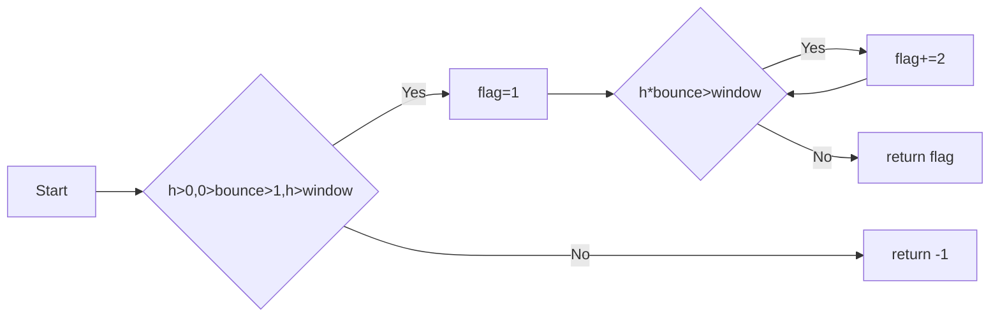

# Python实验报告2： Python变量、简单数据类型
班级： 21计科1班

学号： B20210302104

姓名： 金皓翔

Github地址：<https://github.com/jhx666oo/python>

CodeWars地址：<https://www.codewars.com/users/jhx666oo>

## 实验过程与结果
## 第一部分 Python变量、简单数据类型和列表简介
   
* 练习2.1

代码
```python
message = "Hello, World!"
print(message)
```
输出
```
Hello, World!
```
* 练习2.2

代码
```python
message = "Hello, World!"
print(message)
message = "This is a new message."
print(message)
```
输出
```python
Hello, World!
This is a new message.
```

* 练习2.3

代码
```python
  name='jinhaoxiang'
  print(f"Hello {name},would you like to learn Python today?")
```

输出
```
Hello jinhaoxiang,would you like to learn Python today?
```
* 练习2.4

代码
 ```python
name='jinhaoxiang'
print(name.title())
print(name.upper())
print(name.lower())
 ```

 输出
```
Jinhaoxiang
JINHAOXIANG
jinhaoxiang
```
* 练习2.5

代码
```python
str="Kobe Bryant: Everything negative - pressure, challenges - is all an opportunity for me to rise."
print(str)
```

输出
```
Kobe Bryant: Everything negative - pressure, challenges - is all an opportunity for me to rise.
```
* 练习2.6

代码
```python
name="Kobe Bryant"
message="Everything negative - pressure, challenges - is all an opportunity for me to rise."
print(name+message)
```

输出
```
Kobe Bryant: Everything negative - pressure, challenges - is all an opportunity for me to rise.
```
* 练习2.7

代码
```python
name= ' \t jhx \n '
print(name)
name.rstrip()
name.lstrip()
name.strip()
print(name)
```

输出
```
 	 jhx 
 
 	 jhx
```
* 练习2.8

代码
```python
filename='python_homework2.txt'
print(filename.removesuffix('.txt'))
```

输出
```
python_homework2
```
* 练习2.9

代码
```python
print(5 + 3)
print(4 * 2)
print(8 / 1)
print(9 - 1)
```
输出
```
8
8
8.0
8
```
* 练习2.10

 代码
```python
message = 666
print("My favorite number is " + str(message))
```
输出
```
My favorite number is 666
```
* 练习2.11
  
 代码
```python
#输出我最喜欢的数字
#2023.10.8
message = 666
print("My favorite number is " + str(message))
```
输出
```
My favorite number is 666
```
* 练习2.12
  
 代码
```python
import this
```
输出
```

```
## 第二部分 Codewars Kata挑战
### 第1题：求离整数n最近的平方数（Find Nearest square number）

难度：8kyu

你的任务是找到一个正整数n的最近的平方数 例如，如果n=111，那么nearest_sq(n)（nearestSq(n)）等于121，因为111比100（10的平方）更接近121（11的平方）。 如果n已经是完全平方（例如n=144，n=81，等等），你需要直接返回n。 

[代码提交地址](https://www.codewars.com/kata/5a805d8cafa10f8b930005ba) 
```python
import math

def nearest_sq(n):
    sqrt_n = math.isqrt(n) 
    lower_square = sqrt_n ** 2
    upper_square = (sqrt_n + 1) ** 2

    if abs(n - lower_square) <= abs(n - upper_square):
        return lower_square
    else:
        return upper_square

```

* 解析：首先使用 math.isqrt 计算 n 的平方根，然后计算了最接近 n 的两个平方数，即比 n 小和比 n 大的两个平方数。最后，它比较了 n 与这两个平方数的距离，返回距离更近的那个平方数。如果 n 已经是完全平方数，它会直接返回 n。


### 第2题：弹跳的球（Bouncing Balls）

难度：6kyu

一个孩子在一栋高楼的第N层玩球。这层楼离地面的高度h是已知的。他把球从窗口扔出去。球弹了起来, 例如:弹到其高度的三分之二（弹力为0.66）。他的母亲从离地面w米的窗户向外看,母亲会看到球在她的窗前经过多少次（包括球下落和反弹的时候）？

一个有效的实验必须满足三个条件：

1. 参数 "h"（米）必须大于0
2. 参数 "bounce "必须大于0且小于1
3. 参数 “window "必须小于h。

如果以上三个条件都满足，返回一个正整数，否则返回-1。 注意:只有当反弹球的高度严格大于窗口参数时，才能看到球。 

[代码提交地址](https://www.codewars.com/kata/5544c7a5cb454edb3c000047/train/python)
```python
def bouncing_ball(h, bounce, window):
    if h>0.0 and 0.0<bounce<1.0 and h>window:
        flag=1
        while h*bounce>window:
            h*=bounce
            flag+=2
        return flag
    return -1
```
* 解析：
小球下落上升有两次经过窗户，首次下落算一次经过窗户，循环判断即可

### 第3题： 元音统计(Vowel Count)

难度： 7kyu

返回给定字符串中元音的数量（计数）。对于这个Kata，我们将考虑a、e、i、o、u作为元音（但不包括y）。输入的字符串将只由小写字母和/或空格组成。

[代码提交地址](https://www.codewars.com/kata/54ff3102c1bad923760001f3)
```python
def get_count(sentence):
    get_count="aeiou"
    count=0
    for char in sentence:
        if char.islower() and char in get_count:
            count+=1
    return count
    pass
```
* 解析：这个函数遍历输入字符串中的每个字符，如果字符是小写字母且是元音字母之一，就增加计数器的值。最后返回计数器的值，即元音字母的数量。

### 第4题：偶数或者奇数（Even or Odd）
难度：8kyu

创建一个函数接收一个整数作为参数，当整数为偶数时返回”Even”当整数位奇数时返回”Odd”。 

[代码提交地址](https://www.codewars.com/kata/53da3dbb4a5168369a0000fe) 
```python
def even_or_odd(number):
    return "Odd" if number%2 else "Even"
```
* 解析：利用数取余的特性
## 第三部分 使用Mermaid绘制程序流程图

第2题：弹跳的球（Bouncing Balls）流程图如下：


## 实验考查

请使用自己的语言并使用尽量简短代码示例回答下面的问题，这些问题将在实验检查时用于提问和答辩以及实际的操作。

1. Python中的简单数据类型有那些？我们可以对这些数据类型做哪些操作？
   ```markdown
   答：
   Python中有许多简单数据类型，主要包括以下几种：

   整数（int）：表示整数值，例如：1、100、-5等。

   浮点数（float）：表示带有小数部分的数值，例如：3.14、2.0、-0.5等。

   字符串（str）：表示文本数据，可以包含字母、数字、符号等字符组成的序列，例如："Hello, World!"、"12345"等。

   布尔值（bool）：表示True（真）或False（假）的布尔值，用于逻辑判断，例如：True、False。

   NoneType：表示空值或缺失值，通常用于初始化变量或表示函数没有返回值。

   可以做以下操作：

   算术运算：对整数和浮点数进行加法、减法、乘法和除法等运算。
  
   字符串操作：对字符串进行拼接、切片、查找子串、替换等操作。

   逻辑运算：使用布尔值进行逻辑与（and）、逻辑或（or）、逻辑非（not）等操作。

   比较运算：比较两个值的大小，例如等于（==）、不等于（!=）、大于（>）、小于（<）等。

   类型转换：可以将一个数据类型转换为另一个，例如将整数转换为浮点数或字符串，或将字符串转换为整数。

   成员运算：检查一个值是否包含在序列中，例如使用in关键字检查元素是否在列表中。

   获取数据类型信息：使用type()函数可以获取变量的数据类型。

   空值检查：使用None来检查一个变量是否为空或是否已初始化。

2. 为什么说Python中的变量都是标签？
   ```markdown
    答：Python中的变量被称为"标签"是因为它们在内部的工作方式与传统的变量概念有所不同。在许多其他编程语言中，变量被视为存储数据的容器，也就是说，当你创建一个变量并赋予它一个值时，实际上是在内存中分配了一块空间来存储这个值。这个变量与其存储的数据之间有一个直接的关联。
    但在Python中，变量实际上是指向内存中某个对象的引用或地址。这意味着变量本身并不存储数据，而只是指示了存储数据的位置。当你创建一个变量并将其赋值为某个值时，实际上是在内存中创建了一个对象，然后将变量指向该对象的地址。这就像是给对象贴上了一个标签，你可以通过这个标签来访问对象。

3. 有哪些方法可以提高Python代码的可读性？
    ```markdown
    答：可以通过合适的空格换行，比较一致的缩进字节，以及添加注释等方法来提高python代码的可读性。
## 实验总结

总结一下这次实验你学习和使用到的知识，例如：编程工具的使用、数据结构、程序语言的语法、算法、编程技巧、编程思想。
  
  - 在这次实验中，我更多的是掌握了一些有关python的编程知识，并能开始利用python编程语言解决一些简单的编程问题，这是一个良好的开始，同时我也学习了有关Mermaid绘制程序流程图的语法，这个工具可以在vscode上画流程图，我觉得很方便，期待下次实验能学到更多有用的知识。